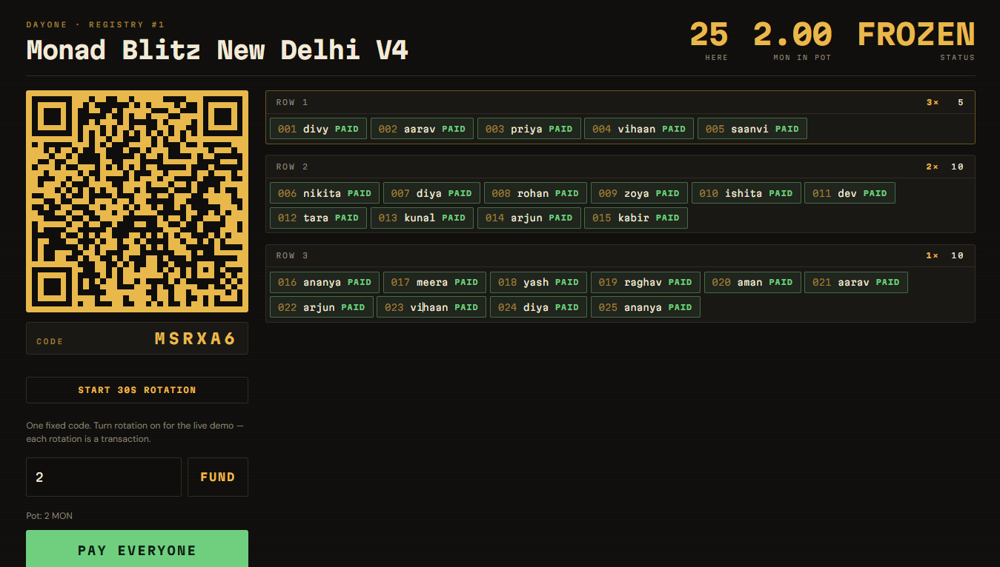
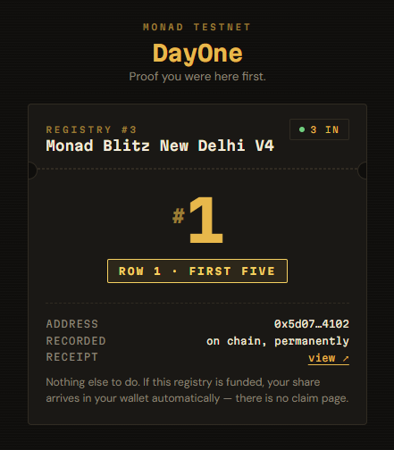

# DayOne

**Proof of who backed you first — and payouts that actually reach them.**

Built at Monad Blitz New Delhi V4.

| | |
|---|---|
| **App** | [dayone-peach.vercel.app](https://dayone-peach.vercel.app) |
| **Contract** | [`0xee9E5859674DB82c67d21710f1eFF8301eFdc1bD`](https://testnet.monadvision.com/address/0xee9E5859674DB82c67d21710f1eFF8301eFdc1bD) |
| **Network** | Monad Testnet · chain ID `10143` |

---

## What it looks like

**The board** — what goes on the projector. Supporters flip in as they join, rows fill by cohort, and a green `PAID` lands on each one the moment the payout clears.

<p align="center">
  
</p>

**The ticket** — what a supporter sees on their phone, one tap after scanning the QR.

<p align="center">
  
</p>

---

## The problem

Being early to something is worth a lot, and right now it is worth nothing.

You followed the creator at 400 followers. You were in the Discord before the token. You showed up to the first meetup. All you have is a screenshot — unverifiable, and worth nothing to anyone.

Crypto's answer is the airdrop, and airdrops are structurally broken: **they make you come and claim.** A team snapshots who was early, builds a Merkle tree, deploys a claim page — and most recipients never show up. The money sits there.

That is not a UX failure. It is an economics one. **Paying 500 people directly on Ethereum costs more than the payout**, so pull-based distribution was the only affordable design. Every claim page in existence is a workaround for expensive settlement.

## What DayOne does

1. A creator, project or event **opens a registry**.
2. People **tap one link** — their address, the exact second they arrived, and their position in the queue are written on chain.
3. The owner **funds the registry** and presses one button.
4. The contract **splits the pot by cohort** and sends it straight to every supporter's wallet.

Cohorts are seat rows:

| Cohort | Ranks | Weight |
|---|---|---|
| Row 1 | 1 – 5 | 3× |
| Row 2 | 6 – 15 | 2× |
| Row 3 | 16+ | 1× |

Nobody claims anything. Nobody has to be online. The money simply arrives.

## Why this needs Monad

Measured on testnet, paying **25 supporters from a 2 MON pot**:

```
totalWeight = 5×3 + 10×2 + 10×1 = 45
unit        = 2 MON / 45 = 0.044444444444444444 MON

Row 1  →  0.1333 MON each
Row 2  →  0.0889 MON each
Row 3  →  0.0444 MON each
            2.0 MON distributed, 2 wei of rounding dust left
```

Two `payout` transactions, fired concurrently, twenty recipients each. One `join` costs ~121,000 gas.

On Ethereum those twenty-five individual transfers would cost more than the payout itself — which is the **only** reason airdrops are claim-based. At 400 ms blocks and near-zero fees, **the claim step stops existing.** That is a change in product design, not a benchmark number.

## Architecture

```
   creator wallet ──[ fund ]──▶  CONTRACT  ──[ payout × N ]──▶  supporters
        │                        (holds pot)                    (paid directly)
        │
        └──[ rotateCode ]──▶ QR on screen ──scan──▶ join(id, code, handle)
```

```
openRegistry(name)              create a registry
rotateCode(id, hash)            set the current join code, previous stays valid
setGateEnabled(id, bool)        kill switch for the gate
join(id, code, handle)          record address + timestamp + rank
fund(id) payable                move money into the contract
freeze(id)                      lock ranks, fix each cohort's share
payout(id, batchSize)           pay the next batch directly
claimOwed()                     fallback for an address that could not receive
withdrawUnspent(id)             recover the rounding dust
```

### Design decisions

**Freeze before paying.** If people kept joining mid-payout, everyone's share would shift while the contract was spending. `freeze` locks the ranks and computes the per-weight unit once — the same reason a snapshot block exists in an airdrop. `payout` auto-freezes if the owner forgets, because on stage there is one button, not three.

**A cursor, not a loop.** `payout(id, batchSize)` walks `paidUpTo`, so batches can be fired concurrently and a failed batch resumes exactly where it stopped. Nobody is paid twice. Twenty-five supporters at a batch size of twenty is two transactions: ranks 1–20, then 21–25.

**Push by default, pull as a fallback.** Transfers use a 2300 gas stipend so a recipient cannot re-enter, and a failed transfer is recorded in `owed` instead of reverting. One address that cannot receive never blocks the other 199, and their money is still theirs.

**Handles live in events, not storage.** The rank lives in contract state because the payout math needs it. The display name is emitted in `Joined` — permanently on chain, but without paying for storage the contract never computes on.

**A rotating join code.** Without a gate, anyone who knows the registry id can call `join` from anywhere and take Row 1 before the room has scanned; a bot watching `RegistryOpened` would beat every human at 400 ms. The dashboard generates a new code every 30 seconds and stores only its **hash** on chain — everything on chain is public, so storing the code itself would defeat the point. `join` requires the matching preimage. The contract accepts the current **and** previous hash, so a transaction submitted across a rotation boundary does not fail.

**Rewards are cohorts, not a curve.** Inside one 400 ms block, transaction order is the chain's, not the user's. A `1/rank` curve would turn network jitter into money. Cohort boundaries are far enough apart that block-level noise cannot move anyone between rows.

## Three things Monad does differently

All three were found by testing at scale, not by reading docs first.

**`eth_getLogs` is capped at 100 blocks.** The board originally rebuilt its list from `Joined` events and silently showed nothing. The list now comes from the `entries` array — which has no range limit — and logs are only used to attach display names.

**The RPC allows 15 requests/second.** Reading 25 entries as 25 separate `eth_call`s tripped the limit, the refresh threw, and the board rendered the registry name but no supporters. All reads now go through Multicall3 (`0xcA11bde0…76CA11`) as a single request.

**Every account reserves 10 MON.** Consensus works on a state view a few blocks behind execution, so a slice of each balance is set aside to guarantee gas. A payer *below* that reserve can only send one value-moving transaction every few blocks — the rest get **included and then revert**. The wallet seeder was firing concurrent transfers and losing all but one; funding is sequential now.

Gas is also charged on the **limit**, not on usage, so a reverted transaction costs the same as a successful one. Sizing gas limits properly is not a micro-optimisation here.

## Known limitations

Stated plainly, because they are real:

- **Sybil resistance.** One person with fifty wallets and fifty valid codes joins fifty times. The rotating code buys presence and blocks bots; it does not establish personhood. The right answer is one device, one join — and Monad has a native P256 precompile at `0x0100` (EIP-7951, 6900 gas), so a passkey signature from a Secure Enclave verifies on chain with no verifier library. That is the next version.
- **Codes are visible once used.** After the first join in a window the plain code sits in that transaction's calldata. The window is short for exactly this reason. The proper fix is a creator-signed attestation bound to each joiner's address, verified with `ecrecover`.
- **Handles are self-declared.** Identity is the address; the handle is only a label.
- **Joiners pay their own gas.** Someone with an empty wallet cannot join. A relayer, or an embedded wallet, fixes this.
- **Demo signing key.** The dashboard signs with a local testnet key so payout batches can go out concurrently without a wallet prompt per batch. Testnet only, never a key holding real assets.

## Next steps

- Passkey-gated joins via the P256 precompile — one device, one rank
- Creator-signed attestations instead of a shared rotating code
- Gasless joins through a relayer
- Embedded wallets, so someone without a wallet can still be on the list

## Run it locally

```bash
git clone https://github.com/Phoenix1808/DayOne.git
cd DayOne/web
npm install
npm run dev
```

`web/.env`:

```
VITE_DEMO_KEY=0x...      # testnet-only signing key for the dashboard
```

Fill a registry with throwaway wallets, for demoing without an audience:

```bash
node scripts/seed.mjs <registryId> <count>
```

## Stack

Solidity · Monad Testnet · React · Vite · viem · Multicall3

## License

MIT
